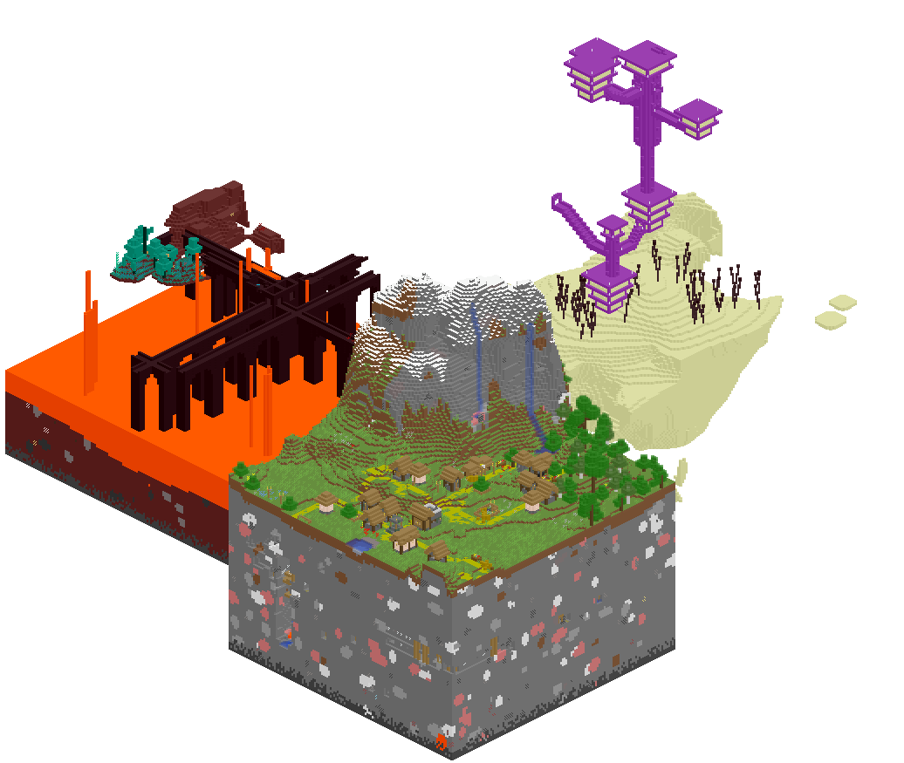

# `mcmap` - Isometric map visualizer


*Original project by Simon Rettberg. All the credit goes to him for the idea and vision.*

`mcmap` is a tool allowing you to create isometric renders of your Minecraft save file.



This project is under __heavy__ development, but compatible with newer versions of Minecraft.

## Usage

### Basic invocation

```
mcmap <options> path/to/<your save>
```

The standard save path is different between OSes:
- On Linux, it is `$HOME/.minecraft/saves`;
- On macOS, under `~/Library/Application\ Support/minecraft/saves`;
- On Windows, the standard path is `%AppData%\.minecraft\saves`. However as only [Ubuntu on Windows](https://ubuntu.com/tutorials/tutorial-ubuntu-on-windows#1-overview) is supported, the path to access the save folder is the following: `/mnt/c/<Your user>/AppData/Roaming/.minecraft/saves`.

#### Windows

Native Windows is currently unsupported, but the program works using [Ubuntu on windows](https://ubuntu.com/tutorials/tutorial-ubuntu-on-windows#1-overview) to get a linux terminal and launch it from there, as on a linux platform.

Most of the code uses `std::filesystem` to access files and from my understanding should be cross-platform. I have no experience nor interest in making a Windows GUI, but it should be pretty straightforward, as it [has been done before](https://www.minecraftforum.net/forums/mapping-and-modding-java-edition/minecraft-tools/1260568-minemapper-dynamic-mapping-for-windows). If anyone has the sources to that old viewer, sharing them to update them would be greatly appreciated.

### Options

| Name         | Description                              |
|--------------|------------------------------------------|
|`-from X Z`     |sets the coordinates of the block to start rendering at|
|`-to X Z`       |sets the coordinates of the block to end rendering at|
|`-min/max VAL`  |minimum/maximum Y index (height) of blocks to render|
|`-file NAME`    |sets the output filename to 'NAME'; default is `./output.png`|
|`-colors NAME`    |sets the custom color file to 'NAME'|
|`-nw` `-ne` `-se` `-sw` |controls which direction will point to the top corner; North-West is default|
|`-marker x z color`      |draw a marker at `x` `z` of color `color` in `red`,`green`,`blue` or `white`; can be used up to 256 times |
|`-nowater`      |do not render water|
|`-nobeacons`      |do not render beacon beams|
|`-shading`      |toggle shading (brightens blocks depending on height)|
|`-nether`      |render the nether|
|`-end`          |render the end|
|`-dim[ension] [namespace:]id` |render a dimension by namespaced ID|
|`-mb VAL`       |maximum memory to use at once (default 3.5G, increase for large maps if you have the ram)|
|`-tile VAL`       |render terrain in tiles of the specified size (default 1024)|
|`-padding`      |padding around the final image, in pixels (default: 5)|
|`-h[elp]`      |display an option summary|
|`-v[erbose]`   |toggle debug mode|
|`-dumpcolors`  |dump a json with all defined colors|

*Note: Currently you need both -from and -to to define bounds.*

#### Tips

`mcmap` will render the terrain in batches using all the threads of your computer. Unfortunately, when those batches merge, some artifacts are created: lines appear in oceans where the merge was operated.

Use `-tile` with a bigger value to limit the amount of batches and thus of artifacts. This is limited by the available memory, as rendering a whole map iin one go may require 10+ gigabytes of ram.

Use `-tile` with a lower value to increase performance. 256 and 512 tiles are really efficient.

## Color file format

`mcmap` supports changing the colors of blocks. To do so, prepare a custom color file by editing the output of `mcmap -dumpcolors`, and pass it as an argument using the `-colors` argument.

The accepted format is a `json` file, with a specific structure.
The root contains a list of [block IDs](https://minecraft.gamepedia.com/Java_Edition_data_values#Blocks) to modify, with the namespace prefix, such as `namespace:block`.

#### Simple block

To define a color for a simple, regular block, provide an entry with the following format:

```
"namespace:block": [RED, GREEN, BLUE, ALPHA]
```

All the fields must be integer values between 0 and 255.

Examples:
```
{
    "minecraft:dirt":   [134, 96, 67, 255],
    "minecraft:stone":  [128, 128, 128, 255],
    ...
}
```

#### Complex block

Some blocks are better looking when drawn in a specific way.
To specify that a block has to be drawn differently, you have to provide a `json` structure with the fields:

```
"namespace:block": {
    "type":     <BlockType>,
    "color":    [RED, GREEN, BLUE, ALPHA],
    "accent":   [RED, GREEN, BLUE, ALPHA] (Optional)
}
```

The available available block types are:

|Name|Appearance|Accent support|
|-|-|-|
|`Full`|Default. Full-block.|No|
|`Hide`|Do not render the block entirely.|No|
|`Clear`|This block is optimized for transparent block in large quantities, such as glass and water. The top of the block is not rendered, making for a smooth surface when blending blocks together.|No|
|`Thin`|Will color only the top of the block underneath. Used for snow, rails, pressure plates.|No|
|`Slab`|Half block.|No|
|`Stair`|Renders a stair block.|No|
|`Rod`|A slimmer block, used for fences and walls.|No|
|`Wire`|Small dot on the floor, used for tripwire and redstone.|No|
|`Head`|Smaller block, also used for pots, pickles, and mushrooms.|No|
|`Plant`|Used in a variety of cases, renders a leaf-like block.|No|
|`UnderwaterPlant`|Same as `Plant`, but the air is water-colored. Used for sea-grass and kelp.|No|
|`Fire`|Fire-like. Used for fire.|No|
|`Beam`|Internal block type, used for markers and beacon beams.|No|
|`Torch`|Three pixels in a vertical line, with the top pixel rendered with the accent color.|Yes|
|`Ore`|Block with veins of color. The vein is rendered with the accent color.|Yes|
|`Grown`|Blocks that have a different layer on top. Grass, nylium, etc. The top layer is rendered with the accent color.|Yes|
|`Log`|Directionnal block, to render logs/pillars as close as possible. The center of the pillar is rendered with the accent color. Used for logs, pillars, basalt.|Yes|

__NOTE__: Waterlogged blocks will be rendered within water instead of air by default according to their blockstates. However, sea-grass and kelp are hardcoded to be underwater and their blockstates won't reflect this, so they have to be defined as `UnderwaterPlants`.

Examples:

```
{
    "minecraft:dirt":   [134, 96, 67, 255],
    "minecraft:grass_block": {
        "type":     "Grown",
        "color":    [134, 96, 67, 255],
        "accent":   [102, 142, 62, 255]
    },
    "minecraft:snow": {
        "type":     "Thin",
        "color":    [245, 246, 245, 254]
    }
}
```

## Compilation

`mcmap` depends on the `PNG` and `zlib` libraries.
Development was made using `gcc` version 10, and can be compiled with `gcc` 8 or later or `clang` 10 or later.
Configuration is done using `CMake`.

#### Linux

Getting the libraries depends on your distribution:

- Ubuntu: `apt update && apt install git make g++ libpng-dev cmake`;
- Archlinux: `pacman -S --needed git gcc make libpng cmake`.

Then get the code and compile:
```
git clone http://github.com/spoutn1k/mcmap
cd mcmap
cmake .
make -j
```

#### macOS

In an Apple environment, you need to install the libraries. 
You also need a developer toolkit recent enough, with the version of `g++ --version` superior to 10. 

Using [`brew`](https://brew.sh/):
```
brew install libpng libomp
git clone http://github.com/spoutn1k/mcmap
cd mcmap
cmake .
make -j
```

#### Windows

Download and set up [Ubuntu on windows](https://ubuntu.com/tutorials/tutorial-ubuntu-on-windows#1-overview) then the steps are the same as Linux/Ubuntu.

## Troubleshooting

### Compilation fails

Check `g++ --version`. Supported versions are at least 8.0.0.
If your version is not up to date, install a more recent one using your package manager.
You will have access to the new version using `g++-Y` with Y being the version number.
Compile using `CXX=g++-Y make`.

### Compilation fails complaining about OMP something

Try compiling with `OPENMP=NOTHXM8 make`.
This disables the underlying threading code, so performance may drop.

### Output has lines in the ocean

This is due to the merging algorithm.
Try increasing the tile size with the `-tile` option, or change the color of the water block to use the `Full` block type to make it less noticeable.
