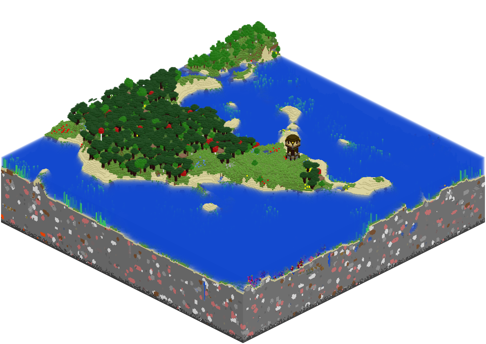

# mcmap - Tiny map visualizer

`mcmap` is a tool allowing you to create isometric renders of your Minecraft save file.



This fork is under heavy development, but compatible with newer versions of Minecraft.

## Usage

__Linux / MacOS__
```
./mcmap <options> ~/.minecraft/saves/<your save>
```

## Options

| Name         | Description                              |
|--------------|------------------------------------------|
|-from X Z     |sets the coordinates of the block to start rendering at|
|-to X Z       |sets the coordinates of the block to end rendering at|
|-min/max VAL  |minimum/maximum Y index (height) of blocks to render|
|-file NAME    |sets the output filename to 'NAME'; default is output.png|
|-nw -ne -se -sw |controls which direction will point to the *top left* corner; North-West is default|

*Note: Currently you need both -from and -to to define bounds, otherwise the entire world will be rendered.*
